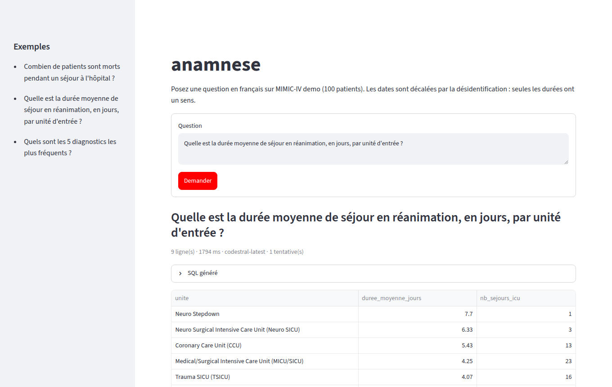
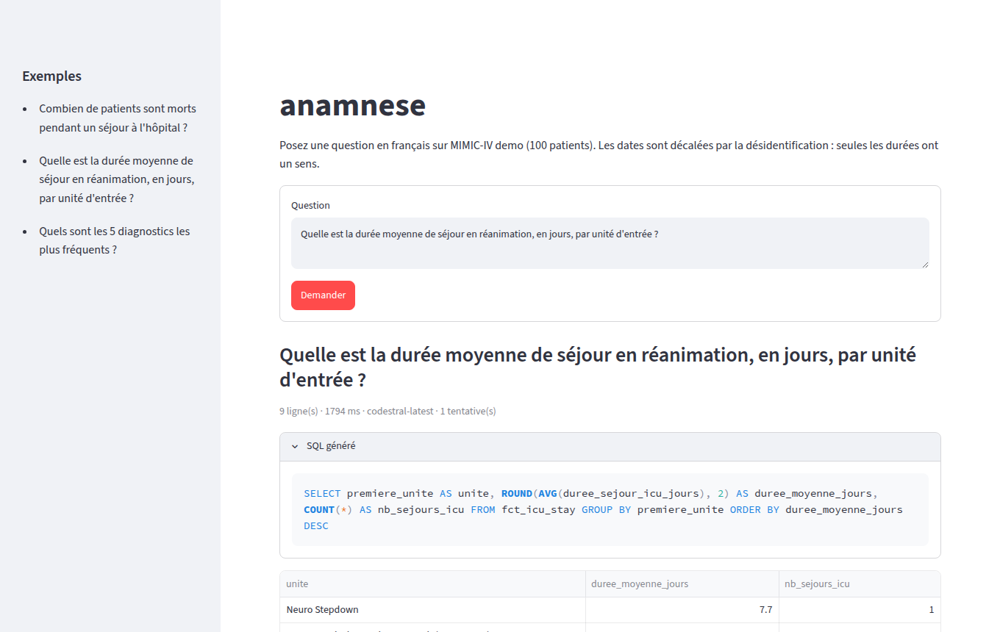
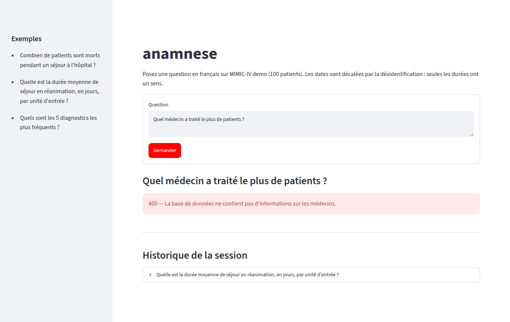
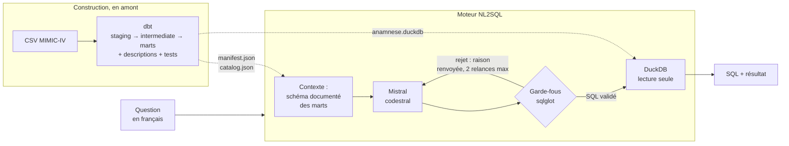
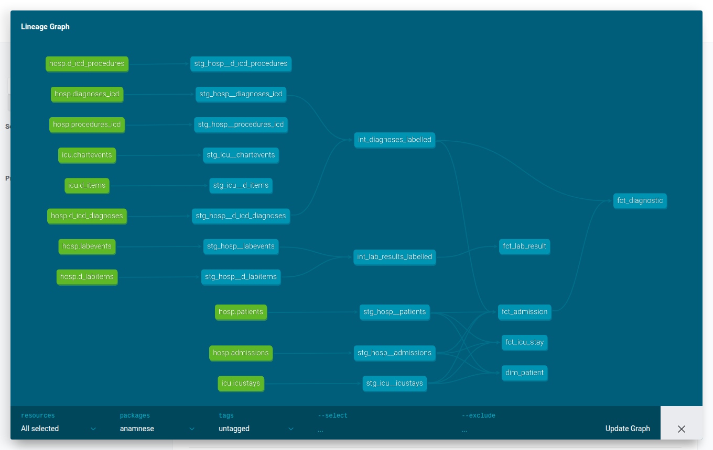
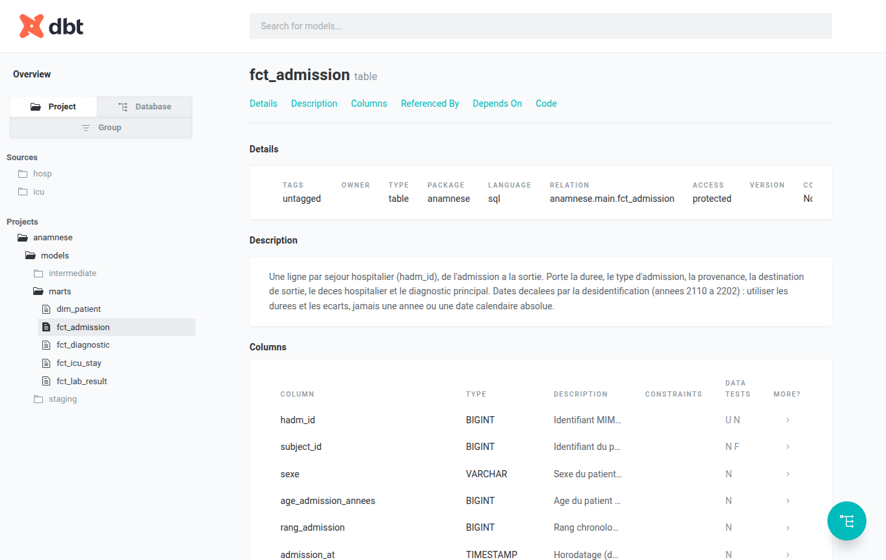
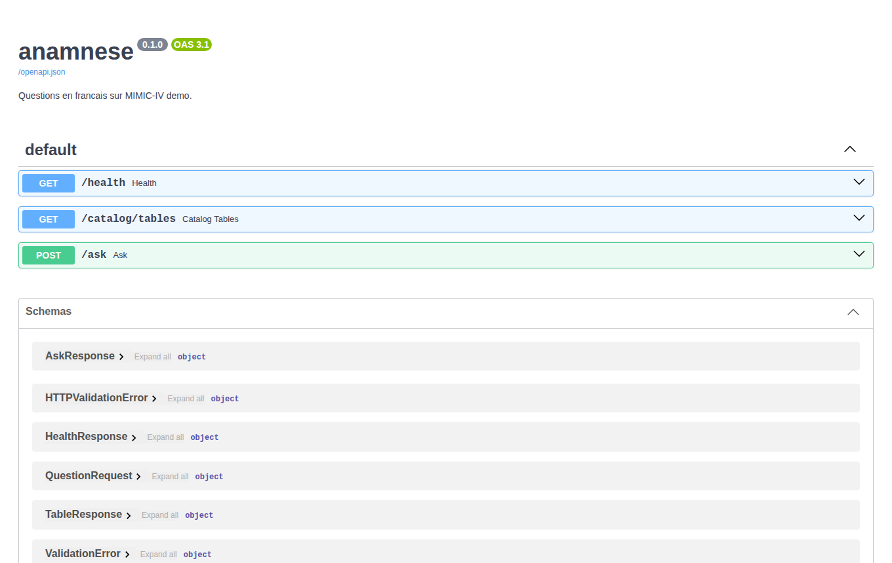

# anamnese

**Posez une question en français à une base clinique. Obtenez la requête SQL et la
réponse — sans que le modèle de langage ne voie jamais une donnée patient.**

[](https://github.com/Adjaro/anamnese/actions/workflows/ci.yml)



anamnese traduit une question en langage naturel en SQL sur
[MIMIC-IV demo](https://physionet.org/content/mimic-iv-demo/2.2/), une base de
réanimation désidentifiée de 100 patients. dbt construit et **documente** des
tables analytiques dans DuckDB ; un modèle Mistral écrit le SQL à partir de cette
documentation ; des garde-fous valident la requête avant de l'exécuter en lecture
seule.

| | |
|---|---|
| **97 %** de bonnes réponses | sur 30 questions de référence, avec `codestral-latest` |
| **0** ligne de données envoyée au LLM | il ne reçoit que des noms de colonnes, des types et des descriptions |
| **2 s** par question | contexte, génération, validation et exécution compris |
| **0,002 $** par question | au tarif Mistral de septembre 2026 |

---

## Démonstration

Le SQL généré est toujours visible : l'utilisateur peut vérifier ce qui a été
calculé, pas seulement lire un chiffre.



Une question à laquelle la base ne permet pas de répondre est **refusée** plutôt
que devinée. Ici, MIMIC-IV demo ne contient aucune donnée sur les médecins :



---

## Comment ça marche



1. **dbt** transforme les CSV bruts en cinq tables analytiques larges et
   dénormalisées (les *marts*), testées et décrites colonne par colonne.
2. **Le catalogue** lit la documentation produite par dbt et en fait le contexte
   du modèle : noms, types, unités, valeurs possibles, sens d'un `NULL`.
3. **Mistral** écrit une requête DuckDB, ou refuse (`CANNOT_ANSWER`) si la question
   sort du schéma.
4. **Les garde-fous** analysent l'arbre syntaxique de la requête : un seul
   `SELECT`, des tables de la liste blanche uniquement, aucune fonction d'accès au
   disque, au réseau ou à l'environnement.
5. **DuckDB** exécute en lecture seule, sans accès externe, avec une limite de
   lignes et de durée. Une requête rejetée ou en erreur est renvoyée au modèle avec
   la raison, deux fois au plus.

### Ce que le modèle voit — et ne voit pas

| Le modèle reçoit | Le modèle ne reçoit jamais |
|---|---|
| le nom des tables et des colonnes | une ligne de la base |
| leurs types et leurs descriptions | un échantillon de valeurs |
| la question | un résultat de requête |
| la raison d'un rejet de schéma ou de syntaxe | un message d'erreur pouvant citer une valeur |

Ce dernier point n'est pas théorique : une erreur de conversion DuckDB cite la
valeur fautive (`Could not convert string 'NEG' to DOUBLE`). Le moteur ne transmet
alors au modèle que le type de l'erreur. Un test le vérifie.

---

## Les données

MIMIC-IV Clinical Database Demo 2.2 : 100 patients de réanimation d'un hôpital
américain, 275 séjours, 107 727 résultats d'analyse. dbt en tire cinq marts, seules
tables exposées au modèle :

| Mart | Une ligne par | Lignes |
|---|---|---:|
| `dim_patient` | patient | 100 |
| `fct_admission` | séjour hospitalier | 275 |
| `fct_icu_stay` | séjour en réanimation | 140 |
| `fct_diagnostic` | diagnostic d'un séjour (CIM-9 ou CIM-10) | 4 506 |
| `fct_lab_result` | résultat d'analyse de laboratoire | 107 727 |



**Les descriptions pilotent la qualité davantage que le prompt.** Elles sont
écrites pour une machine qui doit produire du SQL sans voir les données : chaque
colonne donne son unité, ses valeurs exactes, son référentiel de codes et le sens
d'un `NULL`. Chaque valeur citée a été vérifiée sur la base, et les listes de
valeurs sont verrouillées par des tests dbt : une description devenue fausse casse
le build au lieu de tromper le modèle.



Trois pièges de MIMIC sont écrits noir sur blanc dans ces descriptions :

- **les dates sont décalées** dans le futur (années 2110 à 2202) : seules les durées
  et les écarts ont un sens, jamais une année ;
- **deux versions de la CIM coexistent** : 493 codes existent à la fois en CIM-9 et
  en CIM-10, avec des sens différents ;
- **`valeur_texte` est textuelle** (`'NEG'`, `'<1'`, `'___'`) : tout calcul passe
  par `valeur_num`.

---

## Évaluation

Le modèle n'a pas été choisi à l'intuition : 30 questions de référence, dont le SQL
attendu a été écrit et vérifié à la main, sont rejouées par `make eval`. La
comparaison porte sur les **résultats**, pas sur le texte du SQL : plusieurs
requêtes différentes sont correctes.

| Modèle | Réussite | Coût de la campagne |
|---|---:|---:|
| **`codestral-latest`** | **97 %** (29/30) | 0,049 $ |
| `ministral-14b-latest` | 90 % (27/30) | 0,032 $ |
| `ministral-8b-latest` | 80 % (24/30) | 0,025 $ |
| `ministral-3b-latest` | 67 % (20/30) | 0,021 $ |

Les questions couvrent comptages, agrégations, jointures code → libellé, filtres
temporels relatifs, durées, sous-requêtes, tris, et deux questions volontairement
hors schéma dont la seule bonne réponse est le refus. Le seul échec de codestral
(q19) est une jointure temporelle entre analyses et séjours en réanimation.

`codestral-latest` est donc le modèle par défaut ; `MISTRAL_MODEL` en change sans
toucher au code.

---

## Démarrage

Prérequis : Docker et une clé API [Mistral](https://console.mistral.ai).

```bash
make setup     # dépendances, .env, hooks git
# renseigner MISTRAL_API_KEY dans .env
make data      # télécharge MIMIC-IV demo 2.2 (16 Mo) et inventorie les colonnes
make serve     # construit le warehouse, puis API sur :8000 et interface sur :8501
```

Ouvrir http://localhost:8501.

| Service | Rôle | Port |
|---|---|---|
| `dbt` | construit le warehouse et le catalogue, puis s'arrête | — |
| `api` | FastAPI, lit les données en lecture seule | `ANAMNESE_API_PORT` (8000) |
| `app` | Streamlit, ne parle qu'à l'API | `ANAMNESE_APP_PORT` (8501) |

Un port déjà pris se change dans `.env`. Pour reconstruire le warehouse pendant que
l'API tourne : `docker compose run --rm dbt`. Le build se fait dans un fichier à
part, puis un renommage atomique le met en place ; l'API voit les nouvelles données
sans redémarrer. Un mart **ajouté ou restructuré** demande en revanche
`docker compose restart api`.

Sans Docker : `make build`, puis `make api` et `make app` dans deux terminaux.

### Ligne de commande

```bash
uv run python -m anamnese.engine "Combien de patients ont eu plus d'un séjour en réanimation ?"
```

---

## API



| Route | Rôle |
|---|---|
| `POST /ask` | `{"question": "..."}` → `{sql, colonnes, lignes, duree_ms, tentatives, modele}` |
| `GET /health` | l'API répond ; présence du warehouse et du catalogue |
| `GET /catalog/tables` | marts interrogeables et leurs colonnes |

| Code | Cas |
|---|---|
| `400` | question vide, invalide ou hors du schéma |
| `422` | SQL rejeté par les garde-fous, ou en échec après les relances |
| `502` | échec de l'appel à Mistral |
| `503` | warehouse ou catalogue absent |

```bash
curl -s localhost:8000/ask -H 'content-type: application/json' \
  -d '{"question": "Quel pourcentage des séjours comporte un passage en réanimation ?"}'
```

---

## Développement

| Commande | Effet |
|---|---|
| `make check` | lint et tests : la porte de sortie locale, identique à la CI |
| `make build` | reconstruit le warehouse et le catalogue dbt |
| `make eval` | rejoue l'évaluation ; `EVAL_ARGS="--modeles a,b"` pour comparer |
| `make sql-lint` | nomenclature SQL des modèles dbt |
| `make help` | toutes les cibles |

Les garde-fous sont couverts par 85 tests, dont les injections classiques
(`; DROP TABLE`, `UNION` vers une table interdite, CTE masquant une table,
`SELECT … INTO`, `read_csv`, `getenv`) ; chaque règle a été éprouvée par mutation.
Les hooks git refusent un secret, un fichier de `data/` ou un message de commit hors
du format Conventional Commits ; la CI rejoue les mêmes contrôles et un second
scanner de secrets.

```
anamnese/
├── transform/             projet dbt : staging → intermediate → marts documentés
├── src/anamnese/
│   ├── catalog.py         documentation dbt → contexte du modèle, liste blanche
│   ├── guardrails.py      validation du SQL généré
│   ├── llm.py             client Mistral
│   ├── engine.py          orchestration, relances, exécution en lecture seule
│   ├── api.py             FastAPI
│   └── prompts/           prompt système et exemples, versionnés
├── app/                   interface Streamlit
├── eval/                  30 questions de référence et comparateur
├── scripts/               téléchargement MIMIC, build atomique du warehouse
└── docker/                une image par service
```

[`CLAUDE.md`](CLAUDE.md) fixe les règles du projet : stack, garde-fous,
nomenclature, git. [`PLAN.md`](PLAN.md) est la feuille de route en huit étapes.

---

## Limites connues

- **Données de démonstration** : 100 patients, tous passés en réanimation. Les
  chiffres illustrent le fonctionnement, pas une réalité clinique.
- **Jointures temporelles** entre tables : le point faible du modèle mesuré par
  l'évaluation.
- **Reproductibilité** : température 0 et graine fixe ne rendent pas l'API Mistral
  parfaitement déterministe ; le score est stable, le texte du SQL peut varier.
- **Images Docker** de 1,3 à 1,7 Go : l'API embarque des dépendances qui ne servent
  qu'à l'interface.

## Données et licence

Code sous licence MIT. Les données MIMIC-IV relèvent de leur propre licence
PhysioNet et ne sont pas redistribuées ici : `make data` les télécharge depuis
PhysioNet. La version complète de MIMIC-IV exige un accès accrédité (formation CITI
et licence PhysioNet) ; ce dépôt n'utilise que la démo, librement accessible.
